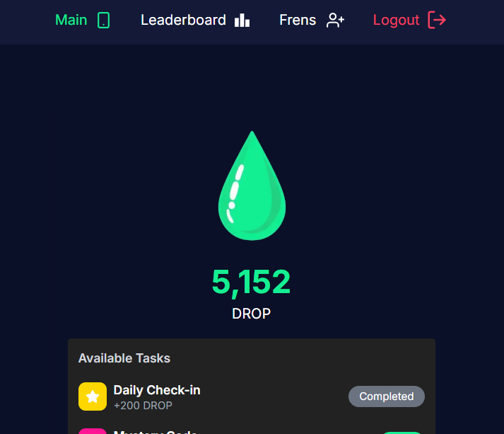
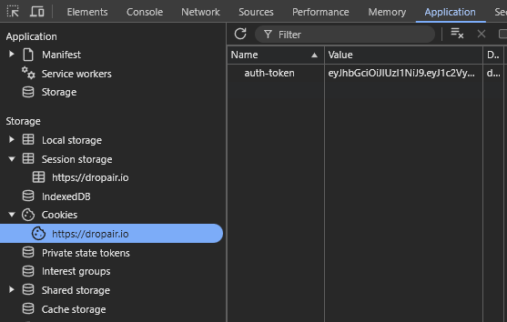

# Dropair Auto checkin


**Dropair** before start the script you must have account in [Dropair](https://dropair.io?ref=YLJJ8E)
- register to functor network [https://dropair.io](https://dropair.io?ref=YLJJ8E)
- insert Twitter username
- insert code on your twitter bio
- login and finish other tasks

# how to run 
## clone the repository
```bash
git clone https://github.com/ChocoPie02/dropair.git
cd dropair
```
## install the requirements
```bash
npm install
```
## fill your auth-token each line in `accounts.txt`
```bash
nano accounts.txt
```
**get your auth-token from cookie under tab aplication on devtool**


## run the script
```bash
npm start
```